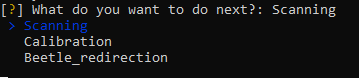

# User Manual

The user manual describes how to use our holodeck system for redirecting dung beetles.

## Hardware setup
The hardware setup has already been done. In case of accidents, web pages related to hardware settings are placed here.
- LIDAR: https://buy.garmin.com/en-US/US/p/578152
- Turret, servos, U2D2, microcontroller, and more: https://www.trossenrobotics.com/p/ScorpionX-RX-64-robot-turret.aspx
- Laser: https://se.rs-online.com/web/p/laser-modules/1271557

## Software setup
### Arduino
For Arduino, the executable file has been written and does not need to be changed. However, if you want to make some modifications to the executable file, you can modify the Dungbeetle.ino file in the DungBeetle folder. If you need to rewrite the ino file into the arduino, you can check this web page to find what you might need : https://learn.trossenrobotics.com/arbotix/7-arbotix-quick-start-guide
### Raspberry pi
In our system, we use python scripts to control the Raspberry pi. And the environment and libraries required for the program to run have been configured. In case of Raspberry pi is damaged, you can follow the instructions below to install the required libraries.
- OpenCV: https://qengineering.eu/install-opencv-4.5-on-raspberry-pi-4.html
- Inquirer: 
```
pip3 install inquirer
```
- Pandas:
```
sudo apt-get install python3-pandas
```
- Numpy:
```
sudo apt-get install python3-numpy
```
## Instructions about how to run the system
- After connecting the USB port of the arduino to the Raspberry Pi, power on the two microcontrollers.
- Use ssh to control the Raspberry pi remotely
- When you connect to the raspberry pi, run this command to enable the pi camera(You only need to do it once after the Raspberry Pi is powered on):
```
libcamera-jpeg -o test.jpg
```
- Find the .py file and execute
```
python3 Desktop/Raspberry/calibration_test.py
```
- Select the mode you want:

When you place the system in a new room, the first thing you need to do is scanning. After the scanning, you need to do the calibration. The last step is Beetle_redirection. To save your time, you can bypass the scanning and choose calibration if the camera is moved but the system is still in the same place. If the location of the system is exactly where the system was initialized, you can bypass scanning and calibration and choose Beetle_redirection.



- Scanning:
In this mode, the Lidar will scan the whole room and send the pan\&tilt angle data together with the distance data to the Raspberry Pi via serial communication. When the scanning is done, a *scandone* signal will be printed in the terminal which means the scanning process is completed. The data obtained by scanning is stored in *points_cloud.csv* which can be visualized by using *construction.m* in *matlab* folder.

- Calibration:
In this mode, the laser will randomly point to a certain area on the roof(the area can be modified by changing the index range) to do the calibration. Moreover, you can define the number of points you would like to take in calibration by setting the value of variable *number_of_samples* in the code. When the calibration is done, the system will automatically enter the test mode to verify the performance of calibration by comparing the difference between the calculated location of the laser point and the actual location of the laser point. During the calibration, the transformation matrix will be written into *Calibration_matrix.csv* for further use.
- Beetle\_redirection:
Right now this part is just a demo for test for we don't have a real dung beetle to complete our algorithm. However, with the help of pi camera, you can easily get the location of the dung beetle in the image and redirect it by using the algorithm in this mode.


